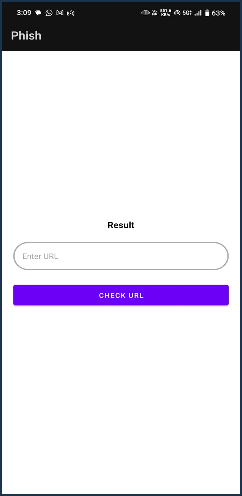
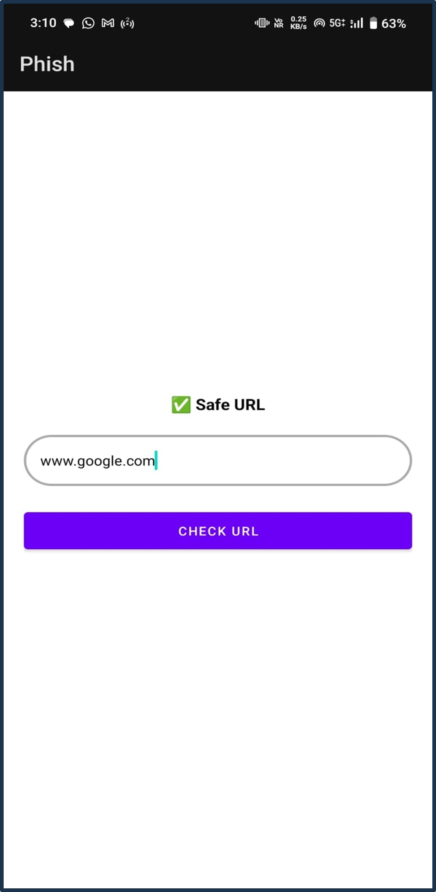

# 🔐 Phishing Link Detector App

An AI-powered Android app that detects phishing URLs using a lightweight TensorFlow Lite model. This application helps users stay safe from malicious websites and phishing attempts in real time.

---

## 🚀 Features

- ✅ Real-time phishing URL detection  
- 🧠 TensorFlow Lite model integration  
- 🗂️ Uses real phishing datasets (CSV and TXT format)  
- 📱 Built with Android Studio (Kotlin)  
- 🔒 Helps prevent malicious web access  

---

## 🛠️ Tech Stack

- **Language**: Kotlin  
- **Framework**: Android SDK  
- **AI Model**: TensorFlow Lite (`.tflite`)  
- **Tools**: Android Studio, Gradle, CSV/TXT datasets  

---

## 🧪 How It Works

1. The app takes a user-entered or extracted URL.  
2. It extracts relevant features from the URL.  
3. The input is passed to a **TensorFlow Lite model** for classification.  
4. The result is displayed: **Safe** or **Phishing**.  

---

## 📦 Dataset Sources

- `phishing_site_urls.csv`  
- `phishing-links-ACTIVE.txt`  
- `phishing-IPs-ACTIVE.txt`  

These files contain known phishing URLs/IPs used to validate or train the model.

---

## 📱 Setup Instructions

1. Clone the repository:
   ```bash
   git clone https://github.com/your-username/phishing-link-detector.git
   📱 Setup Instructions
  2.Open the project in Android Studio.

  3.Sync Gradle and run the app on an emulator or real device.

---

## 🤖 TensorFlow Lite Model
The model was trained using a neural network classifier with extracted features from phishing URLs. It was converted to .tflite for mobile compatibility.

---

## 🧠 Future Improvements
Add support for scanning SMS and emails for links

Improve accuracy using ensemble models

Add URL preview before opening

Integrate with browsers for real-time protection

---

## 📸 Screenshots

 


---

## 🙋‍♂️ Author
Anoob Krishna S N

Computer Science Engineer | Cyber Security Enthusiast

🔗 LinkedIn: www.linkedin.com/in/anoob-krishna

---
